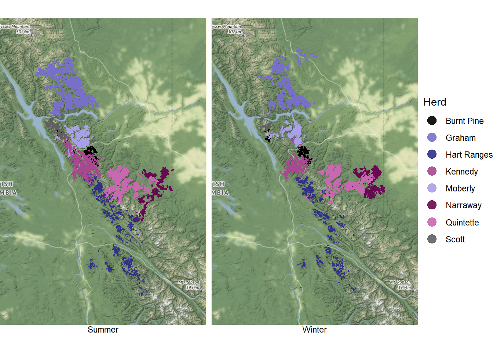

```{r setup, include=FALSE}
options(htmltools.dir.version = FALSE)

knitr::opts_chunk$set(echo = FALSE)

library(tidyverse)
library(kableExtra)
library(lubridate)
library(dplyr)
library(naniar)
library(ggmap)
library(gghighlight)
library(bookdown)
library(plotly)
library(visdat)
```

```{r xaringan-themer, include=FALSE, warning=FALSE}
library(xaringanthemer)
style_duo_accent(
  primary_color = "#1381B0",
  secondary_color = "#FF961C",
  inverse_header_color = "#FFFFFF"
)
```

```{r data, message=FALSE, cache=TRUE}
locations <- readr::read_csv('https://raw.githubusercontent.com/rfordatascience/tidytuesday/master/data/2020/2020-06-23/locations.csv')

caribou_map <- get_map(location = c(-125, 52.5, -119, 57.6), source = "osm") 
```
.center[
# Taipan Figure 3.3
]
```{r goodimg, out.height= "50%"}

```
---
class: inverse, center, middle
.center[
# What Makes it Work?
]

1: BLA BLA  
2: BLA BLA

---
.center[
# Removing the Background
]

```{r goodfig, eval=FALSE, out.height="80%"}
ggmap(caribou_map) +
  geom_point(data = locations, 
             aes(longitude, latitude, col = study_site), size = 0.3, alpha = 0.9) +
  gghighlight(unhighlighted_params = list(colour = "#F2EFC7"), use_direct_label = FALSE) +
  palettetown::scale_colour_poke(pokemon = "golbat") +
  guides(colour = guide_legend(title = "Herd", override.aes = list(size = 4))) +
  facet_wrap(~season, strip.position = "bottom") +
  theme_void() 
```

.pull-left[
```{r firstchange, cache=TRUE}
ggplot() +
geom_point(data = locations, 
             aes(longitude, latitude, col = study_site), size = 0.3, alpha = 0.9) +
  gghighlight(unhighlighted_params = list(colour = "#F2EFC7"), use_direct_label = FALSE) +
  palettetown::scale_colour_poke(pokemon = "golbat") +
  guides(colour = guide_legend(title = "Herd", override.aes = list(size = 4))) +
  facet_wrap(~season, strip.position = "bottom") +
  theme(axis.title = element_blank())
```
]

.pull-right[
- My List 1  

- My List 2
]
---
.center[
# Removing the Legend
]

.pull-left[
```{r secondchange, cache=TRUE}
ggplot() +
geom_point(data = locations, 
             aes(longitude, latitude, col = study_site), size = 0.3, alpha = 0.9) +
  gghighlight(unhighlighted_params = list(colour = "#F2EFC7"), use_direct_label = FALSE) +
  palettetown::scale_colour_poke(pokemon = "golbat") +
  guides(colour = guide_legend(title = "Herd", override.aes = list(size = 4))) +
  facet_wrap(~season, strip.position = "bottom") +
  theme(axis.title = element_blank(),
        legend.position =  "none")
```
]

.pull-right[
- My List 1  

- My List 2
]
